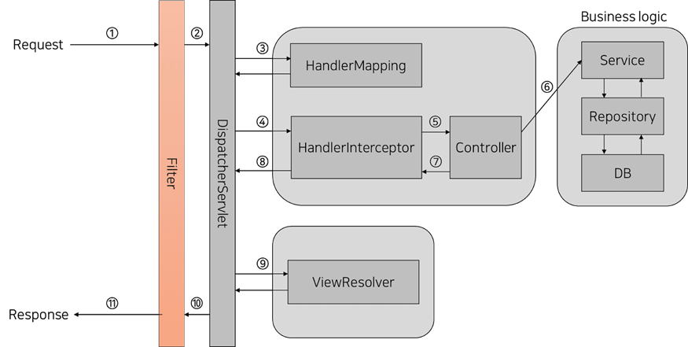

# Backend Framework

### Spring Framework

> 자바 플랫폼을 위한 오픈소스 어플리케이션 프레임워크이다. 기업을 대상으로 하는 개발하며 대규모 데이터처리와 트랜잭션이 동시에 여러 사용자로부터 행해지는 매우 큰 규모의 엔터프라이즈 환경에서 개발하기 위한 모든 기능을 종합적으로 제공하는 경량화된 솔루션이다.

### IoC (Inversion of Control)

> IOC는 Inversion of Control의 약자로 제어의 역전이란 뜻이다. 일반적으로는 객체의 생성부터 호출하는 과정을 모두 사용자가 하지만 IOC에서는 객체를 사용자가 직접 생성하지 않고 객체의 생성과 제어에 대한 모든 권한을 다른 객체에 위임하게 된다.

- #### DI

  DI는 의존성 주입이란 뜻으로 의존적인 객체를 직접 생성하는게 아니라 외부에서 생성되어 주입되는 걸말한다. Spring에서는 의존관계에 있는 컨테이너를 자동으로 연결해줄 수 있다. (@Autowired, @Qualifier)

- #### DL

  DL은 IoC컨테이너가 관리중인 객체 저장소에서 객체를 검색하여 참조하는 방법이다.

### POJO (Plain Old Java Object)

POJO는 오래된 방식의 간단한 자바 오브젝트라는 뜻으로 중량 프레임워크들을 사용할때 사용된 무거운 객체를 반발하서 사용하게 된 용어이다. 

### AOP

AOP는 Aspect Oriented Programming의 약자로 관점 지향 프로그래밍이라고 불린다. 어떤로직을 기준으로 핵심관점, 부가적인 관점으로 나누어서 보고 그 관점을 기준으로 각각 모듈화하겠다는 뜻이다.

### Bean LifeCycle

스프링에서 빈을 관리하면서 생기는 이벤트마다 호출되는 메소드들이 있다.

- #### 초기화 콜백

  스프링 빈이 생성되고 의존성 주입이 완료된 후에 실행되는 초기화 메서드이다.

  - @PostConstruct
  
- #### 소멸 콜백

  컨테이너가 모두 destroyed되면 호출되는 메서드이다.
  
  - @PreDestroy

### Spring MVC Request LifeCycle

#### Filter

- Web Application의 전역적인 로직을 담당한다.
- DispatcherServlet에 들어가기 전에 필터링을 한다.

#### DispatcherServlet

- 모든 Request에 대해 우선적으로 처리해주는 서블릿이다.
- HandlerMapping에게 Request에 대해 매핑할 Controller검색을 요청한다.
- 검색된 Controller에 Request를 전달한다.
- Dispatcher 라는 이름에 맞게 필요한 Controller와 매핑 시키는 역활을 한다.

#### HandlerMapping

- 검색 요청 받은 Controller를 찾아 준다.

#### HandlerInterceptor

- Request가 검색된 Controller와 매핑 되기 전에 부가적인 로직을 추가할 수 있다.

#### ViewResolver

- Controller에서 반환한 View의 이름을 통해 View를 렌더링한다.
