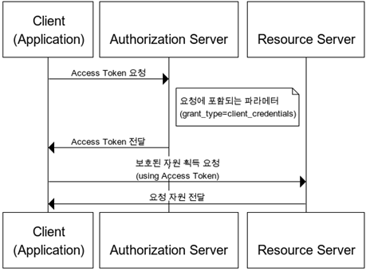

# OAuth

> OAuth는 인증을 위한 개방형 표준 프로토콜이다. 이 프로토콜은 Third-Party에서 리소스 소유자를 대신하여 리소스 서버의 자원에 접근 권한을 위임하는 방식으로 제공한다. 구글, 페이스북, 카카오, 네이버 등에서 간편 로그인 기능으로 OAuth2 프로토콜을 지원한다. 

- Authentication : 인증, 접근 자격이 있는지 검증하는 단계
- Authorization : 인가, 자원에 접근할 권한을 부여하는 것이다. 인가가 완료되면 접근권한이 있는 Access Token은 클라이언트에게 제공한다.
- Access Token : 서버의 리소스에 접근할 수 있는 권한이 있다. 또한 만료기간을 지정할 수 있다.
- Refresh Token : Access Token 만료시 갱신을 위해 사용하는 Token이다. 일반적으로 Access Token바도 만료기간이 길다.

### 인증방식

> OAuth2 프로토콜은 4가지 권한 부여 방식을 제공한다. 

#### 1. Authorization Code Grant

간편로그인 기능에서 주로 사용하는 방법으로 가장 기본이 되는 방식이다. 보통 타사의 클라이언트에게 보호된 자원을 제공하기 한 인증에 사용된다.

권한 부여 승인 요청 시 response_type을 code로 요청한다. 이후 제공되는 로그인 팝업을 통해 로그인을 한다. 로그인이 되면 권한 부여 승인 요청때 받은 redirect_url로 Authorization Code를 전달 한다. Authorization Code를 통해 Access Token은 부여받고 유저는 해당 토큰을 이용하여 Resource Server에 접근하게 된다.

#### 2. Implicit Grant

#### 3. Resource Owner Password Credentials Grant

#### 4. Client Credentials Grant

