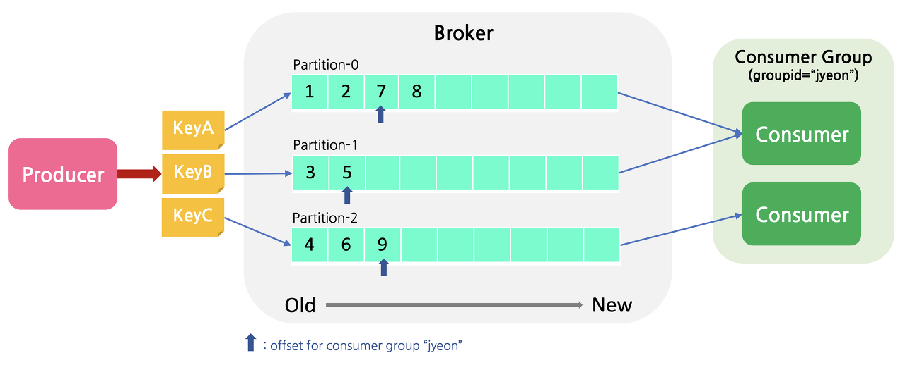
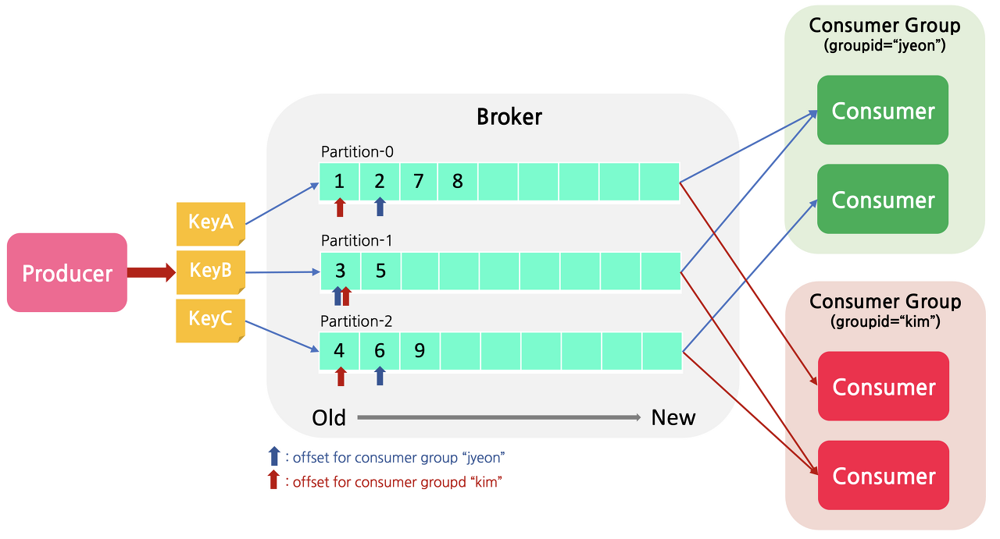

# Kafka

> Apache Kafka는 빠르고 확장 가능한 작업을 위해 데이터 피드의 분산 스트리밍, 파이프 라이닝 및 재생을 위한 실시간 스트리밍 데이터를 처리하기 위한 목적으로 설계된 오픈 소스 분산형 게시-구독 메시징 플랫폼이다.

#### AMQP Middleware

##### Kafka

- Apache Kafka는 빠르고 확장 가능한 작업을 위해 데이터 피드의 분산 스트리밍, 파이프 라이닝 및 재생을 위한 실시간 스트리밍 데이터를 처리하기 위한 목적으로 설계된 오픈 소스 분산형 게시-구독 메시징 플랫폼이다.
- Kafka는 Key를 통해 partition을 구분하여 저장하게 된다.
- Consumer를 확장하게 되면 partition도 늘려야한다.

##### RabbitMQ

- **RabbitMQ**는 오픈 소스 메시지 브로커 소프트웨어(메시지 지향 미들웨어)로서, AMQP를 구현하였으며 그 이후로 STOMP, MQTT 등의 프로토콜을 지원하기 위해 플러그인 구조와 함께 확장되고 있다.
- RabbitMQ는 RoutingKey를 통해 queue를 구분하여 저장하게 된다.
- Consumer를 확장하게 되면 partition도 늘려야한다.

### Topics

토픽은 게시/구독 메시징에서 상당히 보편적인 개념이다. Apache Kafka에서는 토픽을 통해 특정 데이터 스트림에 대해 구독할 수 있는 인터페이스이다. 

### Partitions

Apache Kafka에서 토픽은 파티션이라는 일련의 순서 대기열로 세분화될 수 있다.

### Persistence

Apache Kafka는 레코드/메시지가 게시되면 지속적으로 유지하도록 관리한다. Kafka클러스터는 소비되는 것에 관계없이 보존 시간을 제한할 수 있다. 따라서 레코드/메시지는 보존시간 내에만 사용 가능하다.

### Producer

Apache Kafka에서 프로듀서 개념은 대부분의 메시징 시스템과 다르지 않다. 프로듀서는 레코드/메시지가 게시되어야 되는 토픽을 지정한다.

### Consumer

대부분의 메시징 시스템과 마찬가지로 Kafka의 컨슈머는 레코드/메시지를 처리하는 엔터티이다. 

### Topic / Partition

Producer는 1~9 순서대로 메시지를 publish한다. Consumer가 3개의 파티션을 모두 subscribe하게 되면 1,3,4,2,5,6,7,9,8 순서대로 들어오게된다. 하지만 셋중 하나의 파티션만 subscribe하게되면 해당 파티션 내에서는 순서를 보장한다. 따라서 순서가 보장되어야 되는 메시지라면 Key를 통해 publish하고 해당 파티션을 subscribe하여 순서를 보장할 수 있게된다.

### Consumer Group

다음과 같은 상황이라면 각각의 오프셋을 따로 가지게 된다. 따라서 각각에 오프셋에 따라 같은 시간에 다른 내용을 가져가게 되고 만약 소비가 끝난뒤에 바로 사라지지 않기 때문에 다른 오프셋에서 해당 내용을 가져갈 수 있게된다.

Reference

- https://jyeonth.tistory.com/30