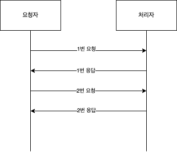
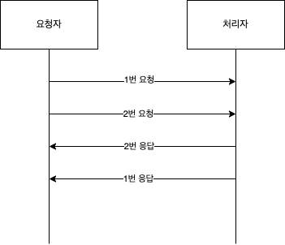
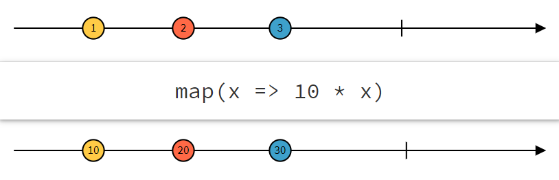
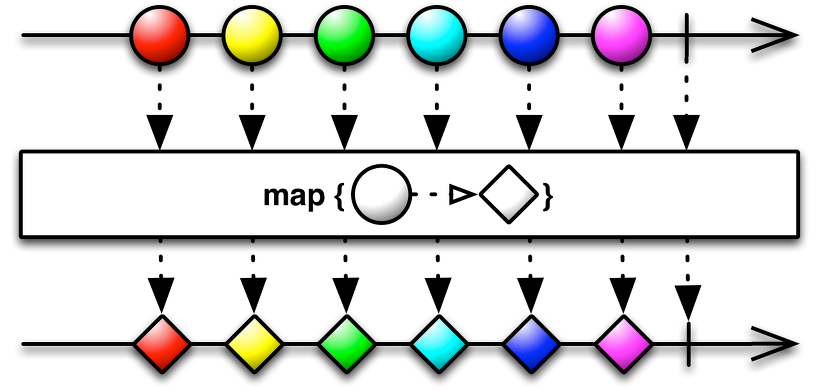
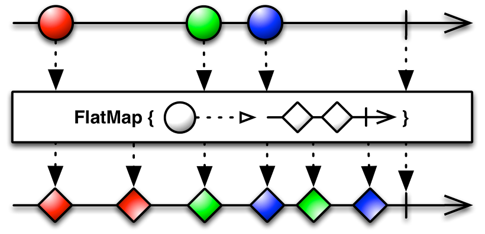
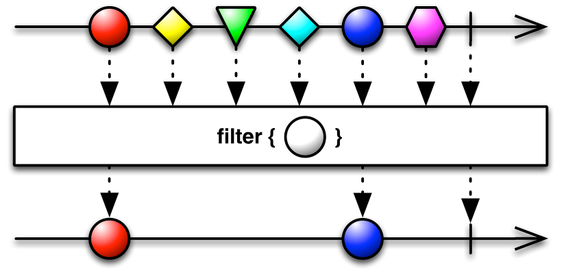
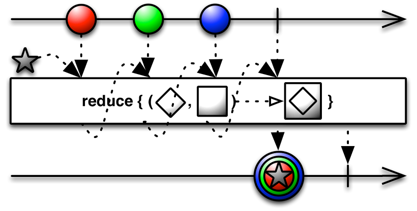

# Reactive Programming

## 동기 (synchronous)

------

동기는 요청자와 처리자를 동기화 한다는 뜻이다. 즉 요청자는 처리자가 완전히 처리될 때까지 기다리게 된다. 따라서 요청 후 다른 작업을 수행 할 수 없게된다.

1번 요청 뒤에 1번 응답을 받을 때 까지 기다리게 된다. 그리고 응답을 받으면 이어서 2번 요청을 하게 된다.

## 비동기 (asynchronous)

------

비동기는 요청자와 처리자를 동기화 하지 않고 처리한다는 뜻이다. 즉 요청자는 처리자에게 요청 후 대기하지 않고 다른 작업을 수행하게 된다.

1번요청 뒤에 1번 응답을 기다리지 않고 이어서 2번 요청을 하게 된다. 응답은 이어서 순서없이 받게 된다.

## Reactive Programing

------

Reactive Programming이란 데이터 흐름과 전달에 관한 프로그래밍 패러다임이다. 명령을 순차적으로 실행하고 설계하는 명령형 프로그래밍(Imperative Programming)과는 반대로 데이터의 흐름과 이벤트를 정의하여 처리한다.

### Stream

Stream은 데이터의 흐름이다. 지속적으로 데이터를 밀어넣고 특정 연산자를 거쳐 사용자에게 동기 또는 비동기방식으로 전달한다.

### Push & Pull

Reactive Programming에서는 Stream에 데이터를 넣는걸 push라고 한다. 해당 데이터를 가져오는걸 pull이라고 한다.

### MarbleDiagram

Marble Diagram은 Reactive Programming을 이해하기 쉽도록 만든 다이어그램이다.

위의 선은 push 하게 될 item의 timeline이고 아래 선은 연산자를 거친 item의 timeline이다. 중간에 있는 함수는 연산자가 된다. 즉 1, 2, 3 데이터는 각각 10이 곱해져서 10, 20, 30이 된다.

### Map

map은 각 데이터를 변환할 수 있는 연산자이다. 다음과 같이 모양을 변환하는 함수가 있을 경우 아래 처럼 마름모로 변환되게 된다.

### FlatMap

flatmap은 map과 같지만 1:N으로 변환이 가능하다 예를 들면 List형태의 데이터의 요소를 꺼내 각각의 item으로 변환이 가능하다.

### Filter

Filter는 말그대로 필요한 데이터만 걸러 낼 수 있다. 다음과 같이 동그라미만 필터를 걸면 아래 동그라미만 나오도록 할 수 있다.

### Reduce

reduce는 여러 데이터를 취합하는 연산자이다. 다음과 같이 앞의 데이터를 다음 데이터 안에 넣는 연산이라면 아래처럼 모두 취합하여 결과가 나온다.

 Reference

- https://reactivex.io/documentation/observable.html
- https://4z7l.github.io/2020/12/01/rxjava-1.html
- https://blog.neonkid.xyz/258